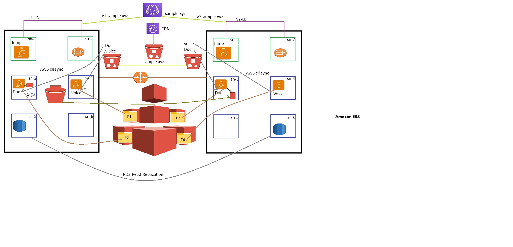

# Region-1 -> N.V (vpc-1)
# Region-2 -> Mum (vpc-2)

#create vpc-1 192.68.0.0/24 with 6 subnets each need 10 ip's. sn1 and sn2 public and other subnets are private
* in sn1 jumpserver
* in sn2 nat gateway
* in sn3 app-1 server (awslinux 2003)
* in sn4 app-2 server (ubuntu)
* in sn5 sql server

# create EBS voluem 1-GB attache into APP-1 server
* create sample file with data inside the ebs volume 1-GB
* using snapshot transfer the data to another region (vpc-2)

# create EFS in vpc-1 with 4 folders each folder with index.html inclue diff WC message (F1,F2,F3,F4)

* create folder doc in app-1
* create folder voice in app-2

* mount efs/F1 into app-1 /var/www/html/
* mount efs/F2 into app-2 /var/www/html/ 

* create ELB with sn1 and sn2 v1-LB

create folder Doc   in app-1  (place some sample files)
create folder voice in app-2  (place some sample files) 

# create s3-bucket-1 in VPC-1 region 
*    with folder  doc and voice
*  using aws cli sync app-1 -> Doc to s3->Doc and app-2 voice to s3->voice 

# create peering b/w vpc-1 and vpc-2

# create vpc-2 with 6 subnets sn1 and sn2 public and other subnets are private
* in sn1 jumpserver
* in sn2 nat gateway
* in sn3 app-1 server (awslinux 2003)
* in sn4 app-2 server (ubuntu)
* in sn5 sql server

# create ELB with sn1 and sn2 - v2-LB

* mount efs/F3 into app-1  /var/www/html/
* mount efs/F4 into app-2  /var/www/html/

* create folder doc in app-1
* create folder voice in app-2

# create EBS voluem 2-GB using snapshot of region -> vpc-1 attache into APP-1 server
* after attach the volume increase the size 1-GB to 2-GB
* without restart need to change the volume size 
* check using df -h  and lsblk

* create ELB with sn1 and sn2 v1-LB

# create s3-bucket-2 in region vpc-2

# create replicate b/w s3-bucket-1 and s3-bucket-2

* in s3-bucket-2 after replication will comes with Doc and voice folder

* sync s3-bucket-2 Doc to app-2 Doc
* sync s3-bucket-2 voice to app-2 voice

# create buctet name sample.xyz (with sample image) and connect CDN

# create Route-53 host zone sample.xyz connect to cdn

# create subdomain v1.sample.xyz access v1-LB

# create subdomain v2.sample.xyz access v2-LB

* use aws console to create the above task
* then try with AWS cli
* try the same in cloud formation
