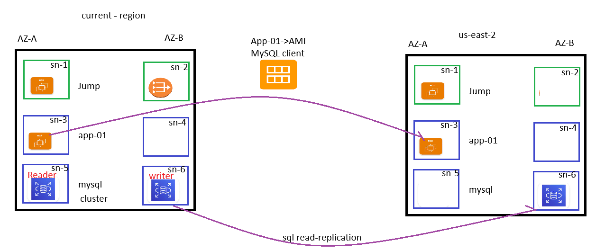

create vpc-1 192.168.0.0/24 with 6 subnets each need 10 ips
sn1,sn2 => public subnets other are in private subnets
sn1,sn3,sn5  => AZ-A
sn-2,sn4,sn6 => AZ-B

create below listed services in required AZ
jump server on SN-1
NatGateway in SN-2
app-1 in sn-3  --> Install mysql client in app-1 
create AMI of App-1 server and transfer the AMI to (US-EAST-2)
create mysql cluster in SN-5 and SN-6 (one will be reader and another will be writer)
create read-replication of mysql to (US-EAST-2)

create student database and add student list in that db

NOTE:
# after installing mysql-client in APP-01 then delte the NAT-NatGateway
# after creating cluster provide sample database with table once done delete writer server and see read become writer

# create replication afer reader beacome writer
once doen then go to (US-EAST-2)

---
create vpc-2  10.0.0.0/24 with 6 subnets each need 10 ips
sn1,sn2 => public subnets other are in private subnets
sn1,sn3,sn5  => AZ-A
sn-2,sn4,sn6 => AZ-B

create below listed services in required AZ
jump server on SN-1
NatGateway in SN-2
using AMI from MYAMI create app-1 in sn-3  
connect read-replicat of mysql share from your region

create the above using terraform and cloudformation too
share the code of both in github

